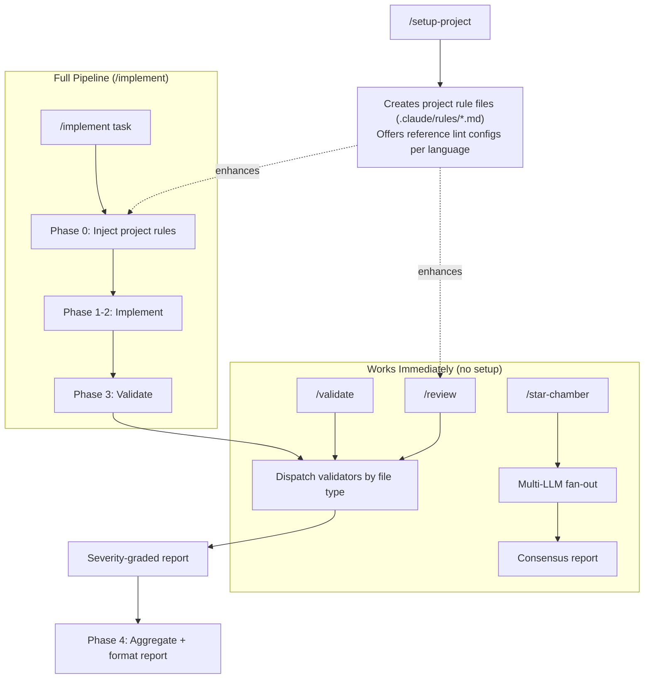
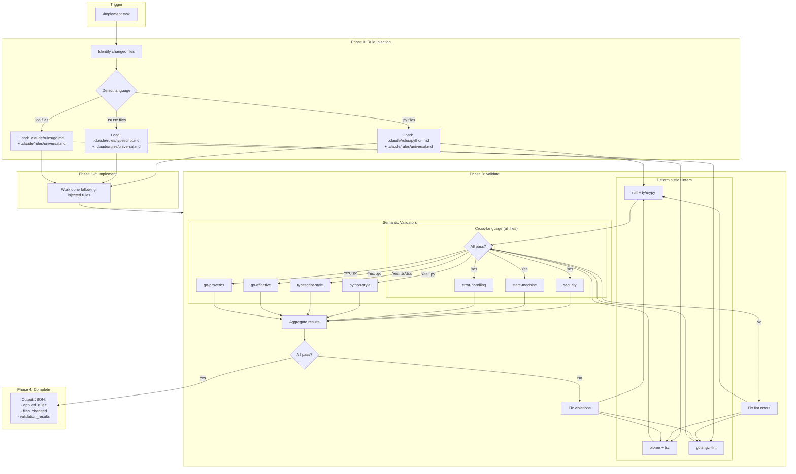
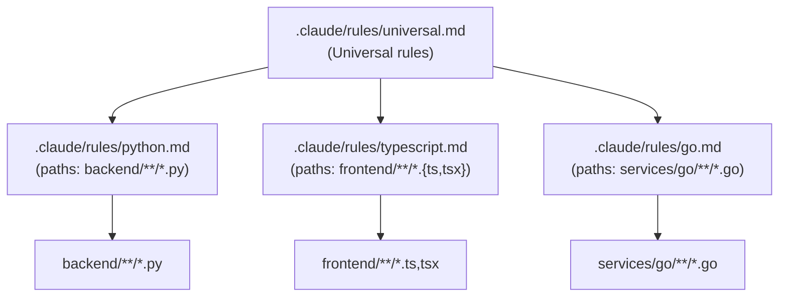
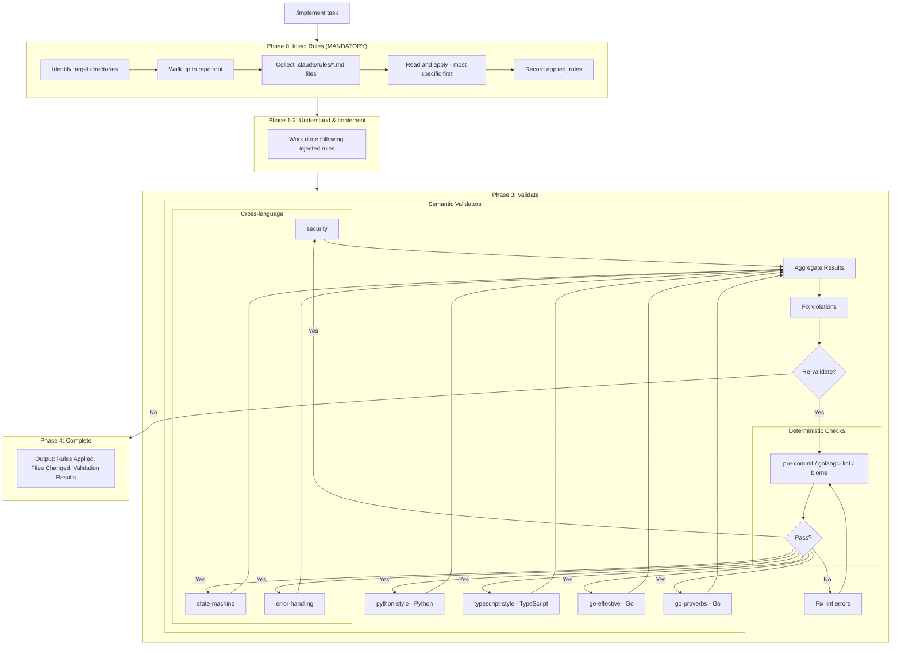
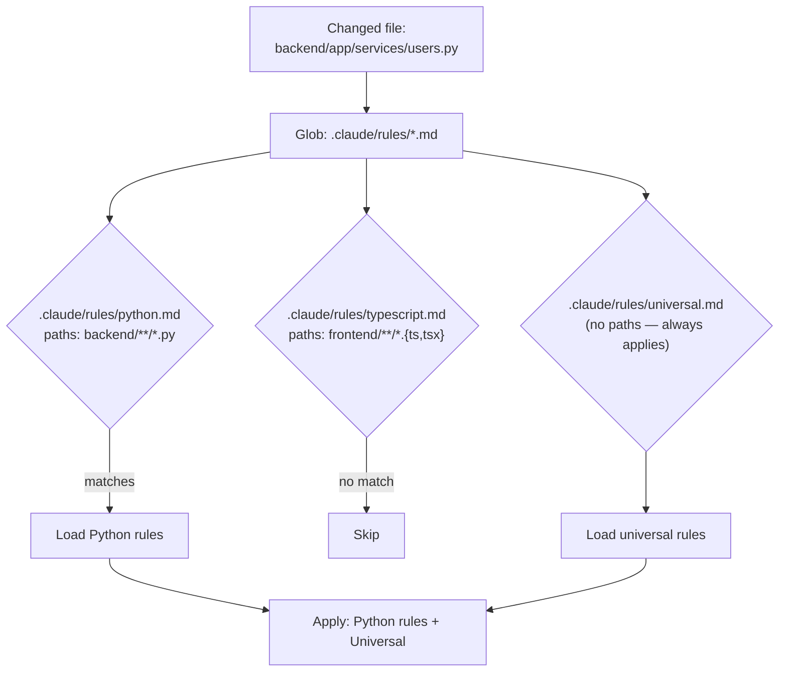
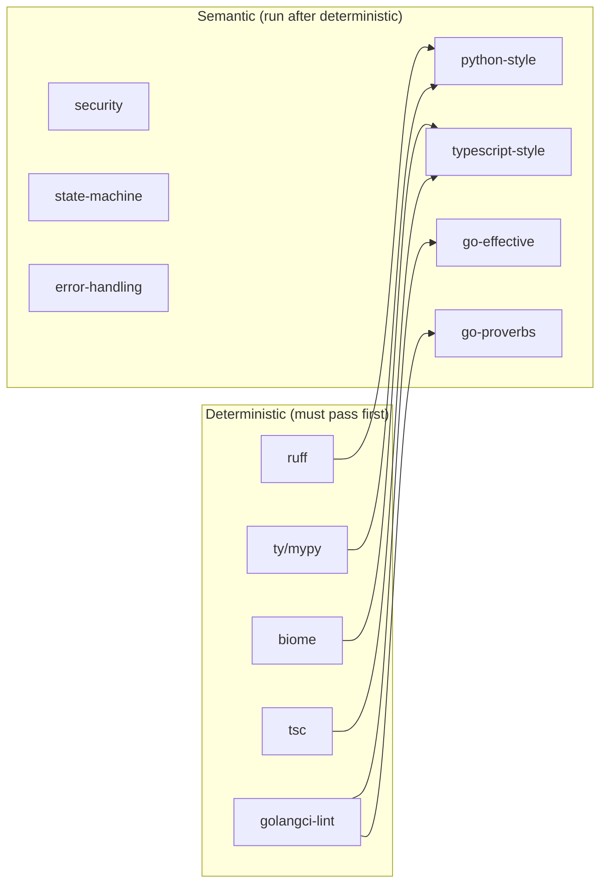
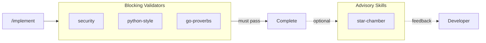

# Architecture

This document explains the design decisions behind agent-pragma.

## User Flow: End-to-End

This diagram shows how all validation skills share the same validators. Skills work immediately with built-in rules; `/setup-project` adds project-specific rules that enhance `/implement` and `/review`.



> **Note:** `/star-chamber` is an advisory skill — it fans out to multiple LLMs for consensus feedback, not through the shared validator pipeline.

## Output Examples

After `/implement` or `/review`, you get both formats:

### Human-Readable Report

```
## Implementation Complete

**Task:** Add user authentication

**Rules Applied:**
- .claude/rules/python.md (scoped to backend/**)
- .claude/rules/typescript.md (scoped to frontend/**)
- .claude/rules/universal.md

**Files Changed:**
- backend/app/services/auth.py: AuthService with login/logout
- backend/app/api/routes/auth.py: POST /login, POST /logout endpoints
- frontend/src/hooks/useAuth.ts: useAuth hook with TanStack Query

**Validation:**
| Validator        | Status | Hard | Should | Warn |
|------------------|--------|------|--------|------|
| security         | ✓ Pass | 0    | 0      | 1    |
| state-machine    | ✓ Pass | 0    | 0      | 0    |
| error-handling   | ✓ Pass | 0    | 0      | 0    |
| python-style     | ✓ Pass | 0    | 0      | 0    |
| typescript-style | ✓ Pass | 0    | 0      | 0    |

**Warnings:**
- security: auth.py:45 - Consider adding rate limiting (advisory)

Ready for /review or commit.
```

### JSON Output (for tooling)

```json
{
  "task": "Add user authentication",
  "applied_rules": [
    ".claude/rules/python.md",
    ".claude/rules/typescript.md",
    ".claude/rules/universal.md"
  ],
  "rule_conflicts": [],
  "files_changed": [
    "backend/app/services/auth.py",
    "backend/app/api/routes/auth.py",
    "frontend/src/hooks/useAuth.ts"
  ],
  "validation": {
    "pass": true,
    "validators": [
      {"name": "security", "pass": true, "hard": 0, "should": 0, "warn": 1},
      {"name": "state-machine", "pass": true, "hard": 0, "should": 0, "warn": 0},
      {"name": "error-handling", "pass": true, "hard": 0, "should": 0, "warn": 0},
      {"name": "python-style", "pass": true, "hard": 0, "should": 0, "warn": 0},
      {"name": "typescript-style", "pass": true, "hard": 0, "should": 0, "warn": 0}
    ],
    "total": {"hard": 0, "should": 0, "warn": 1}
  },
  "warnings": [
    {
      "validator": "security",
      "location": "auth.py:45",
      "note": "Consider adding rate limiting"
    }
  ]
}
```

---

## The Problem

Project rule files (`.claude/rules/*.md`) are **guidance** — they can be ignored or forgotten by the LLM. We needed:

1. Rules that are **mechanically injected**, not hoped-for
2. Validation that **verifies compliance**, not trusts it
3. A system that works for **monorepos with multiple languages**
4. A tool that delivers value **immediately**, without requiring setup before first use

## Core Principles

### 0. Zero-config by default

Validators work standalone with built-in rules — no project rules or `/setup-project` required. Each validator ships with its own rule definitions (the skill prompt templates and `contract.json` in the plugin's `skills/` directory). Project rule files (`.claude/rules/*.md`) are an enhancement for team consistency and monorepo path scoping, not a prerequisite.

### 1. Validators are authoritative, not project rules

Project rule files (`.claude/rules/*.md`) provide guidance. Validators **enforce** rules.

If there's a conflict between what a project rule file says and what a validator checks, the validator wins. This removes ambiguity.

### 2. Rules are injected, not remembered

`/implement` and `/review` **mechanically read** applicable `.claude/rules/*.md` files before doing any work. This is Phase 0 / Step 2 - it happens first, explicitly, and is recorded.

> **Critical**: Phase 0 (rule injection) is mandatory. It must complete before any other phase. This is the single most important design decision - it eliminates reliance on LLM memory.

The LLM doesn't need to "remember" rules - they're injected fresh every time.

### 3. Deterministic before semantic

Linters run first. If they fail, stop. Only then do semantic validators run.

This ensures validator signal quality - they're not wasting time on formatting issues.

### 4. Validators have contracts

Each validator declares:
- What it checks (scope)
- What it doesn't check (excludes)
- What it assumes ran before it (assumes)

This prevents overlap and makes maintenance clear.

## Monorepo Validator Map

This diagram shows the complete flow for a multi-language monorepo from `/implement` through validation.



## Monorepo Directory Structure



## System Flow



## Rule Injection Detail

Rule injection loads all `.claude/rules/*.md` files and applies path-scoped rules to matching files. More specific (path-scoped) rules take precedence over universal rules.

### How Path-Scoped Rules Work



## Validator Contracts

Each validator has a `contract.json` defining its scope and assumptions.

| Validator | Language | Scope | Excludes | Assumes |
|-----------|----------|-------|----------|---------|
| **security** | All | Secrets, Injection, Path traversal, Auth gaps | Code style, Language idioms, Performance | No tool deps (pipeline-gated) |
| **state-machine** | All | State transitions, Terminal state correctness, Cleanup enforcement | Code style, Performance | No tool deps (pipeline-gated) |
| **error-handling** | Go, Python, TS | Swallowed errors, Ignored returns, Silent fallbacks, Broad catching | Error message style, Security implications, Chaining style, Wrapping format, Error context/wrapping quality | No tool deps (pipeline-gated) |
| **go-effective** | Go | Naming, Error handling, Interface design, Control flow | Security, Go Proverbs, Formatting | gofmt, golangci-lint |
| **go-proverbs** | Go | Idiomatic Go philosophy, Concurrency patterns, Abstraction | Security, Effective Go details, Formatting | golangci-lint |
| **python-style** | Python | Google docstrings, Type hints, Error handling, Layered architecture | Security, Performance | ruff, ty/mypy, pre-commit |
| **typescript-style** | TypeScript | Strict mode, React patterns, Hooks usage, State management | Security, Performance | biome, pre-commit |

### Rule Loading Patterns

Validators use one of two internal structures for defining rules:

- **Inline rules** (security, state-machine): All rules are embedded directly in SKILL.md. Suitable for validators with short, language-agnostic rules that apply uniformly to all file types.
- **Language-specific rule files** (error-handling): Rules are split into a `languages/` subdirectory with per-language files (e.g., `languages/go.md`, `languages/python.md`). The SKILL.md loads the applicable files based on changed file extensions. Suitable for cross-language validators that need distinct syntax patterns per language.

Both patterns produce the same unified JSON output. The choice is an internal implementation detail of the validator.

The same per-language file pattern is used by `/setup-project` for lint config detection. Each language directory in `claude-md/languages/{lang}/` contains a `setup.md` alongside the language rules file. The `setup.md` declares which lint config files to check for and which reference config to offer if none are found. This keeps language-specific setup knowledge in language files rather than hardcoded in the skill.

### Validator Dependency Chain

Language-specific semantic validators require their linters to have passed first (tool dependency). Cross-language validators have no tool dependencies but are pipeline-gated — they run after linters pass as a convention for signal quality.



> **Note:** security, state-machine, and error-handling have no linter tool dependencies — they run on any file type without requiring language-specific linters. In the pipeline, they still run after the lint-pass gate as a convention for signal quality.

**HARD vs SHOULD by validator:**

| Validator | HARD Rules | SHOULD Rules |
|-----------|------------|--------------|
| **security** | Secrets, Injection, Path traversal, Auth gaps | Insecure configurations |
| **state-machine** | Invalid transitions, Unreachable states | Missing cleanup on terminal states |
| **error-handling** | Ignored error returns, Empty catch/except, Bare except, Swallowed rejections | Silent fallbacks, Catch returns default |
| **go-effective** | Doc comments, Error return position, No pointer-to-interface | Interface size, Early returns, Parameter count |
| **go-proverbs** | Share memory by communicating, Errors are values, Handle errors gracefully | Interface size, Zero value, Clear vs clever |
| **python-style** | Exception chaining with `from e`, Custom exception hierarchy | Google docstrings, Modern type hints (`str \| None`) |
| **typescript-style** | Strict mode enabled, Functional components only | Proper hook dependencies, TanStack Query for server state |

Cross-language validators (security, state-machine, error-handling) check structural patterns across all languages. Language-specific validators check language idioms. Where both could apply, the cross-language validator owns the structural check and the language validator owns the idiom check. Specifically: error-handling owns *completeness* (is the error handled?), language validators own *style* (how is the error wrapped/chained?).

This prevents:
- Validators reporting on the same thing (noise)
- Validators assuming work that didn't happen
- Scope creep over time

## Severity Model

All validators use the same unified schema:

| Level | Meaning | Action |
|-------|---------|--------|
| **HARD** | Must fix | Blocks completion |
| **SHOULD** | Fix or justify | Requires explicit justification |
| **WARN** | Advisory | Note in output, don't block |

This is intentionally simple. More levels create ambiguity.

## Example Output

### Single Validator Output

Each validator produces JSON in this schema:

```json
{
  "validator": "python-style",
  "applied_rules": [
    ".claude/rules/python.md",
    ".claude/rules/universal.md"
  ],
  "files_checked": ["backend/app/services/users.py"],
  "pass": false,
  "hard_violations": [
    {
      "rule": "Exception chaining required",
      "location": "users.py:45",
      "explanation": "raise UserNotFoundError() should use 'from e'"
    }
  ],
  "should_violations": [],
  "warnings": [],
  "summary": { "hard_count": 1, "should_count": 0, "warning_count": 0 }
}
```

### Aggregated Output (Phase 4)

Phase 4 combines all validator results into a single output:

```json
{
  "task": "implement user authentication",
  "applied_rules": [
    ".claude/rules/python.md",
    ".claude/rules/typescript.md",
    ".claude/rules/universal.md"
  ],
  "rule_conflicts": [],
  "files_changed": [
    "backend/app/services/auth.py",
    "backend/app/api/routes/auth.py",
    "frontend/src/hooks/useAuth.ts"
  ],
  "validation": {
    "pass": false,
    "validators": [
      {
        "name": "security",
        "pass": true,
        "hard_count": 0,
        "should_count": 0,
        "warning_count": 1
      },
      {
        "name": "state-machine",
        "pass": true,
        "hard_count": 0,
        "should_count": 0,
        "warning_count": 0
      },
      {
        "name": "error-handling",
        "pass": true,
        "hard_count": 0,
        "should_count": 0,
        "warning_count": 0
      },
      {
        "name": "python-style",
        "pass": false,
        "hard_count": 1,
        "should_count": 0,
        "warning_count": 0
      },
      {
        "name": "typescript-style",
        "pass": true,
        "hard_count": 0,
        "should_count": 0,
        "warning_count": 0
      }
    ],
    "total": {
      "hard_count": 1,
      "should_count": 0,
      "warning_count": 1
    }
  },
  "blocking_violations": [
    {
      "validator": "python-style",
      "rule": "Exception chaining required",
      "location": "auth.py:67",
      "explanation": "raise AuthenticationError() should use 'from e'"
    }
  ]
}
```

## Why This Works

| Failure Mode | How We Prevent It |
|--------------|-------------------|
| LLM forgets rules | Rules are mechanically injected in Phase 0 |
| Rules not applied | Output includes "Rules Applied" - observable |
| Validators overlap | Contracts declare scope/excludes |
| Validation skipped | `/implement` won't complete until validation passes |
| Silent failures | Validators echo `applied_rules` in JSON output |

## Edge Cases

| Scenario | Handling |
|----------|----------|
| First commit / no HEAD~1 | HEAD~1 diff silently produces nothing; staged and unstaged changes are still captured |
| Detached HEAD | Use `--diff-filter=ACMRT` to detect changes |
| >50 files changed | Process in batches of 50, note batch number |
| Conflicting rules | Prefer more specific rule, log in `rule_conflicts` array |
| New directories created during implementation | Re-run Phase 0 before validation |

### Rule Conflict Logging

When rules conflict (e.g., subdirectory rule contradicts root rule), the conflict is logged for auditability:

```json
{
  "rule_conflicts": [
    {
      "rule": "line-length",
      "root_value": 80,
      "override_value": 120,
      "source": ".claude/rules/python.md",
      "resolution": "Used override (more specific)"
    }
  ]
}
```

The more specific rule always wins, but the conflict is recorded so it can be reviewed.

## Modular Rules

All rules live in `.claude/rules/*.md` at the project root. Language-specific rules use `paths:` frontmatter to scope them to matching files only.

**How each agent loads rules:**

- **Claude Code:** Auto-loads all `.claude/rules/*.md` files natively. No additional configuration needed.
- **OpenCode:** Loads rules via the `instructions` glob in `opencode.json` at the project root. `/setup-project` generates this file with `{"instructions": [".claude/rules/*.md"]}`.

For `/implement` and `/review`, rule injection is mechanical and explicit — the skills read `.claude/rules/*.md` directly. Both agents also auto-load these files for ad-hoc interactions outside the formal workflow.

## Validators

| Validator | Language | Status |
|-----------|----------|--------|
| security | All | ✅ Done |
| state-machine | All | ✅ Done |
| error-handling | Go, Python, TS | ✅ Done |
| go-effective | Go | ✅ Done |
| go-proverbs | Go | ✅ Done |
| python-style | Python | ✅ Done |
| typescript-style | TypeScript | ✅ Done |

### Security: Dual Entrypoint

Security has two entrypoints that share the same rules (plugin path: `skills/security/SKILL.md`):

| Entrypoint | File | When it runs | Model | Key benefit |
|------------|------|-------------|-------|-------------|
| **Skill** | `skills/security/SKILL.md` | Spawned by validation orchestrators (`/review`, `/validate`, `/implement`) | Inherits parent | Ensures security validation in every formal pipeline |
| **Agent** | `agents/security.md` | Auto-invoked when code crosses a trust boundary | Sonnet | Catches issues when code is written outside formal pipelines |

The skill has `user-invocable: false` — it only fires as part of validation orchestrator pipelines. The agent auto-invokes based on its description (untrusted input parsing, query/command construction from user data, credential handling, authorization enforcement, security-relevant configuration). Both entrypoints use the same vulnerability checklist and JSON output schema.

**Why dual entrypoints:** The `/review` pipeline already spawns security as a validator skill. But when users write code directly (without `/implement` or `/review`), security issues go uncaught. The agent fills that gap by auto-invoking on trust-boundary changes, with persistent memory to learn project-specific patterns (known false positives, how the project handles auth, etc.).

---

## Advisory Skills

Advisory skills provide optional, non-blocking feedback. Unlike validators, they don't gate commits or deployments - they offer additional perspectives and insights.

### Star-Chamber: Multi-LLM Craftsmanship Council

Star-chamber has two entrypoints that share a single protocol (plugin path: `skills/star-chamber/PROTOCOL.md`):

| Entrypoint | File | When it runs | Model | Key benefit |
|------------|------|-------------|-------|-------------|
| **Skill** | `skills/star-chamber/SKILL.md` | User types `/star-chamber` | Inherits parent | Live progress in main conversation |
| **Agent** | `agents/star-chamber.md` | Auto-invoked on architectural decisions | Sonnet | Isolated context, persistent project memory |

The skill has `model-invocable: false` — it only fires on explicit user request. The agent auto-invokes based on its description (significant implementations, design trade-offs, second opinions). Both entrypoints set `$STAR_CHAMBER_PATH` and delegate to `skills/star-chamber/PROTOCOL.md` as the single source of truth for the review process.

**Why dual entrypoints:** Running as a skill gives live streaming output during multi-round debates (users see progress). Running as an agent gives isolated context (verbose provider output stays out of the main conversation), persistent memory (learns codebase patterns over time), and cost-appropriate model selection (Sonnet for orchestration).

**Key characteristics:**
- Advisory only (doesn't block like validators)
- Uses `any-llm-sdk` via `uvx` (no global Python install needed)
- Supports parallel and debate review modes, plus design questions
- Persistent project memory for learning codebase patterns across reviews (agent only)

**Execution modes:**
| Mode | Invocation | Description |
|------|------------|-------------|
| Parallel | (default) | Independent calls to all providers simultaneously |
| Debate | `/star-chamber --debate --rounds N` | Multiple rounds with anonymous synthesis between rounds |

**Debate mode** uses [Chatham House rules](https://www.chathamhouse.org/about-us/chatham-house-rule) for inter-round summarization: feedback from each round is synthesized by content themes without attributing points to specific providers. This encourages engagement with ideas rather than sources, and reduces bias from provider reputation.

**Integration:**


**Output:**
- Markdown report with consensus/majority/individual issues
- JSON for tooling integration
- Quality ratings per provider

**Cost consideration:** Each invocation calls all configured providers (~$0.02-0.10 per run). The agent auto-invokes in basic mode only to keep costs predictable; debate mode is reserved for explicit `/star-chamber` invocations.
