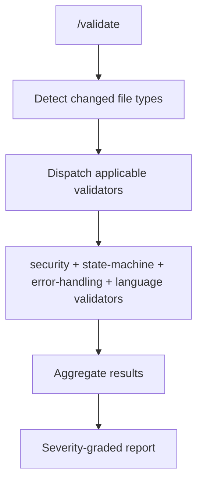
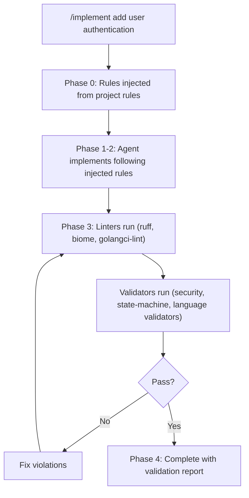

# Agent Pragma

**The problem:** AI coding agents follow rules inconsistently. Rules get forgotten mid-conversation, ignored during complex tasks, or applied partially. There's no enforcement mechanism.

**The solution:** agent-pragma provides skills that mechanically inject rules and validate compliance. Rules aren't remembered - they're enforced by validators that run automatically on every implementation.

**Works with both [Claude Code](https://docs.anthropic.com/en/docs/claude-code) and [OpenCode](https://opencode.ai).**

## System Requirements

- [Claude Code](https://docs.anthropic.com/en/docs/claude-code) or [OpenCode](https://opencode.ai)
- Git
- [uv](https://docs.astral.sh/uv/) (for `/star-chamber`)
- Language toolchains for deterministic linting: Go (`golangci-lint`), TypeScript (`biome`, `tsc`), Python (`ruff`, `ty`/`mypy`)

## Quick Start

### Claude Code

1. Add the marketplace:
   ```text
   /plugin marketplace add peteski22/agent-pragma
   ```

2. Install the plugin:
   ```text
   /plugin install pragma@agent-pragma
   ```

3. Enable auto-update (recommended):
   ```text
   /plugin
   → Marketplaces tab → select agent-pragma → Enable auto-update
   ```
   Third-party marketplaces have auto-update **disabled** by default. Enabling it ensures you receive new versions automatically when Claude Code starts.

4. Run `/validate` in any project — immediate value, no setup needed. Example (after modifying Go files):
   ```text
   > /validate

   # Validation Results

   | Validator | Result | HARD | SHOULD | WARN |
   |-----------|--------|------|--------|------|
   | security | ✓ pass | 0 | 0 | 0 |
   | state-machine | ✓ pass | 0 | 0 | 0 |
   | error-handling | ✓ pass | 0 | 0 | 0 |
   | go-effective | ✗ fail | 1 | 0 | 0 |

   ## HARD violations (must fix)
   - **go-effective** `auth.go:45` — Exported function `HandleLogin` missing doc comment

   ## Verdict
   **FAIL** — 1 HARD violation must be fixed before commit
   ```

Optionally run `/setup-project` to configure project-specific rules — see [Configure Project Rules](#configure-project-rules-setup-project).

> **Note:** Skills are shown as `/star-chamber (pragma)` in the CLI autocomplete. The short form `/star-chamber` is the easiest way to invoke them. The fully-qualified form `/pragma:star-chamber` also works.

### OpenCode

```bash
# Clone the repo
git clone https://github.com/peteski22/agent-pragma.git
cd agent-pragma

# Install globally (skills, agents, and commands available in all sessions)
make install AGENT=opencode

# Run /validate in any project — works immediately
/validate
```

This symlinks skills and generates agents and commands into `~/.config/opencode/`. Run `/validate` in any project — works immediately with built-in rules. For project-specific rules, see [Configure Project Rules](#configure-project-rules-setup-project).

To install into a specific project instead of globally:

```bash
make install AGENT=opencode PROJECT=/path/to/your/project
```

## What Works Immediately

Every skill works after install with zero additional setup (`/star-chamber` requires API keys — see [Environment Variables](#environment-variables)).



`/review` uses the same validator dispatch rules.

### Validators

`/validate` orchestrates all applicable validators based on changed file types:

| Skill | Language | What it checks |
|-------|----------|----------------|
| `/security` | All | Secrets, injection, path traversal, auth gaps |
| `/state-machine` | All | State transitions, terminal state correctness, cleanup enforcement |
| `/error-handling` | Go, Python, TS | Swallowed errors, empty catches, ignored returns, silent fallbacks |
| `/go-effective` | Go | Effective Go — naming, error handling, interface design |
| `/go-proverbs` | Go | Go Proverbs — idiomatic patterns, concurrency |
| `/python-style` | Python | Google docstrings, type hints, exception chaining, architecture |
| `/typescript-style` | TypeScript | Strict mode, React patterns, hooks, state management |

### Code Review

| Skill | What it does |
|-------|--------------|
| `/review` | Runs security, state-machine, error-handling + language-specific validators on current changes. Injects project rules if configured. |
| `/star-chamber` | Multi-LLM consensus review — prompts for provider setup on first run (requires API keys) |

### Severity Levels

| Level | Meaning | What happens |
|-------|---------|--------------|
| **HARD** | Must fix | Blocks `/implement` completion |
| **SHOULD** | Fix or justify | Requires explicit justification to proceed |
| **WARN** | Advisory | Noted in output but doesn't block |

## Configure Project Rules (/setup-project)

For project-specific rules, monorepo path scoping, and team consistency, run:

```text
/setup-project
```

This detects languages, creates project rule files, and configures your agent.

### Monorepo Support

`/setup-project` detects languages at root AND in subdirectories, creating path-scoped rule files:

```text
myproject/
├── .claude/
│   └── rules/
│       ├── universal.md              # Universal rules
│       ├── local-supplements.md      # Documents CLAUDE.local.md usage
│       ├── python.md                 # Python rules (scoped to backend/**)
│       └── typescript.md             # TypeScript rules (scoped to frontend/**)
├── AGENTS.md                          # Agent-agnostic entry point (imports .claude/rules/*.md)
├── CLAUDE.md                          # Claude Code entry point (imports AGENTS.md)
├── CLAUDE.local.md                   # Personal supplements (gitignored)
├── backend/
│   └── pyproject.toml
└── frontend/
    └── package.json
```

Language-specific rules use `paths:` frontmatter to scope them to matching files. When you edit `backend/app/main.py`, both `python.md` (scoped to `backend/**/*.py`) and `universal.md` are applied. `CLAUDE.local.md` at the project root is auto-loaded as per-user supplements.

Both agents load rules from the same `.claude/rules/*.md` files — Claude Code via `CLAUDE.md` → `AGENTS.md`, OpenCode via `AGENTS.md` directly. This keeps a single source of truth for project rules.

### Version Control

**Optionally commit** the generated `.claude/rules/` files so other developers get the same rules without re-running `/setup-project`.

`CLAUDE.local.md` is for per-user, per-machine rules and should be gitignored. If you create it manually, verify it is in your `.gitignore` to avoid committing personal rules.

In git worktrees, use `@import` (a Claude Code directive that includes another CLAUDE.md file) in `CLAUDE.local.md` to reference a shared local rules file rather than duplicating it per worktree:

```markdown
@import ../shared-local-rules.md
```

## The Full Pipeline (/implement)

When you want implementation with automatic validation. This example assumes `/setup-project` has been run to create project rule files — without them, validators still run using their built-in rulesets.

```text
> /implement add input validation to the login form

[Phase 0] Injecting rules from:
  - .claude/rules/universal.md
  - .claude/rules/typescript.md (scoped to frontend/**)

[Phase 1-2] Implementing...
  Created: frontend/src/utils/validation.ts
  Modified: frontend/src/components/LoginForm.tsx

[Phase 3] Validating...
  Linters: biome passed, tsc passed
  security: passed
  state-machine: passed
  error-handling: passed
  typescript-style: passed

[Phase 4] Complete
  Files changed: 2
  Semantic validators run: 4
  Issues: 0
```



**Key principle:** Validators are authoritative, not rules files. If there's a conflict, the validator wins.

## Environment Variables

| Variable | Required | Description |
|----------|----------|-------------|
| `STAR_CHAMBER_CONFIG` | No | Custom path to star-chamber config (default: `~/.config/star-chamber/providers.json`) |
| `OTARI_API_BASE` | For `/star-chamber` (Otari mode) | Base URL of your [Otari](https://github.com/mozilla-ai/otari) gateway |
| `OTARI_API_KEY` | For `/star-chamber` (Otari mode) | Otari gateway API key (or set `OTARI_PLATFORM_TOKEN` for a hosted platform) |
| `OPENAI_API_KEY` | For `/star-chamber` (direct mode) | OpenAI API key (if not routing through Otari) |
| `ANTHROPIC_API_KEY` | For `/star-chamber` (direct mode) | Anthropic API key (if not routing through Otari) |
| `GEMINI_API_KEY` | For `/star-chamber` (direct mode) | Google Gemini API key (if not routing through Otari) |

## Updating

If you enabled auto-update in the Quick Start, new versions are fetched automatically when Claude Code starts and you'll be notified to restart your session.

To update manually, both steps are required in this order:

1. Update the marketplace (fetches the latest plugin metadata):
   ```text
   /plugin marketplace update agent-pragma
   ```

2. Update the plugin (installs the new version):
   ```text
   /plugin update pragma
   ```

To check your current version, run `/plugin` and look under the **Installed** tab.

## Directory Structure

```text
agent-pragma/
├── .claude-plugin/
│   └── marketplace.json        # Claude Code marketplace catalog
├── plugins/
│   └── pragma/                 # Shared plugin content
│       ├── .claude-plugin/
│       │   └── plugin.json     # Claude Code plugin manifest
│       ├── agents/             # Claude Code subagents (security, star-chamber)
│       ├── skills/             # Skills shared by Claude Code and OpenCode
│       ├── claude-md/
│       │   ├── universal/      # Universal rules for all projects
│       │   └── languages/      # Language-specific rules and setup metadata
│       │       ├── go/         # go.md (rules) + setup.md (lint config detection)
│       │       ├── python/     # python.md (rules) + setup.md (lint config detection)
│       │       └── typescript/ # typescript.md (rules) + setup.md (lint config detection)
│       ├── reference/          # Template configs (golangci-lint, pre-commit, biome, etc.)
│       └── tools/              # go-structural deterministic linter
├── scripts/
│   └── install.sh              # Install/uninstall for all agents
├── ARCHITECTURE.md
└── README.md
```

Both Claude Code and OpenCode share the same skills from `plugins/pragma/skills/` and rule files from `plugins/pragma/claude-md/`. OpenCode accesses skills via symlinks created by `make install AGENT=opencode`.

## Legacy Installation (Deprecated)

The previous `make install` + `$CLAUDE_PRAGMA_PATH` approach for Claude Code is deprecated. Use the plugin marketplace instead — it handles updates automatically when auto-update is enabled (see [Quick Start](#claude-code)). If migrating, remove the old symlinks and env var:

```bash
make uninstall
# Remove CLAUDE_PRAGMA_PATH from your shell profile
```

## More Information

- [ARCHITECTURE.md](ARCHITECTURE.md) - Design decisions, validator contracts, system flow diagrams
- [Issues](https://github.com/peteski22/agent-pragma/issues) - Bug reports and feature requests

## License

Apache 2.0 - See [LICENSE](LICENSE) for details.
